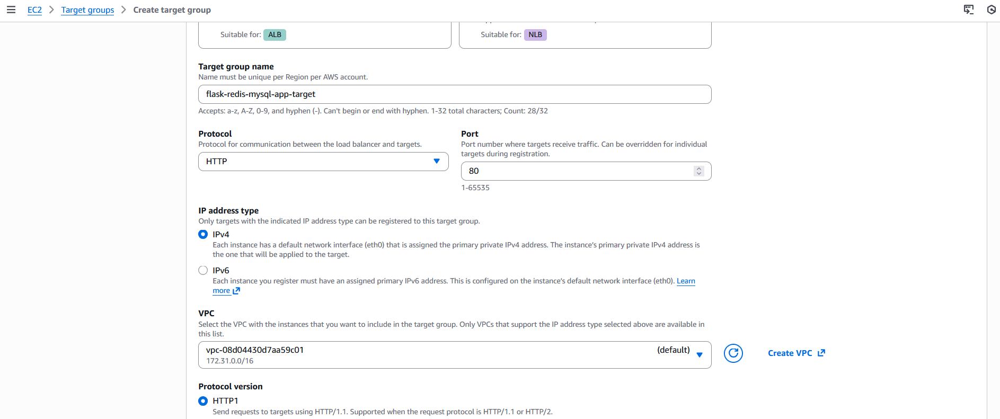
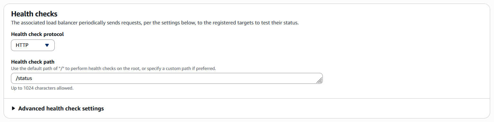
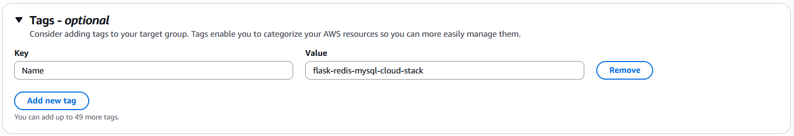
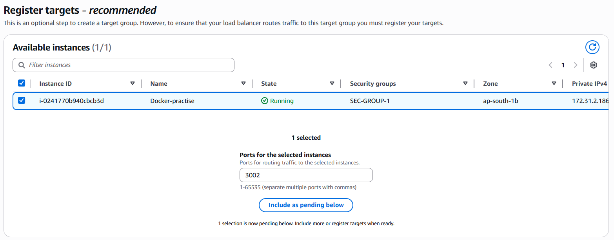
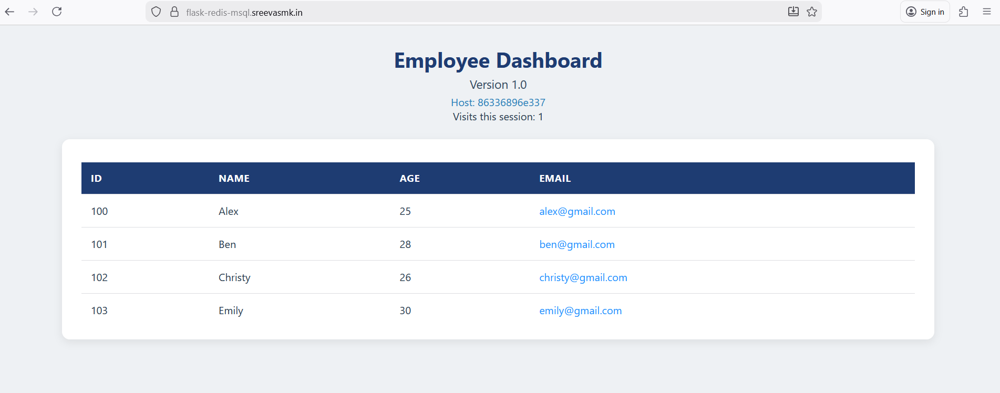
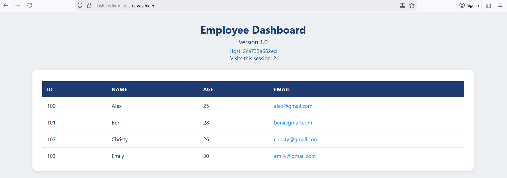

# Employees data app

This repository contains a complete **Flask-based web application stack** showing employees data, integrated with **MySQL** and **Redis**, designed to demonstrate backend application deployment and traffic management patterns.

The primary goal of this repository is to serve as a **foundation project** that can be deployed manually first for learning and validation, and later extended into **container orchestration and infrastructure-as-code workflows**.

---

## Table of Contents

1. [Project Overview](#overview)

2. [Repository Structure](#repository-structure)

3. [Application Layer](#application-layer)

4. [Deployment Approaches Covered](#deployment-approaches-covered)

5. [Manual Deployment Guide](#manual-deployment-guide)

6. [Load Balancing](#load-balancing)

7. [AWS ALB and Domain Setup](#aws-application-load-balancer-alb--domain-setup)

8. [Nginx Load Balancer Setup](#nginx-load-balancer-setup)

9. [Notes and Future Scope](#notes)

---

## Overview

The Flask application connects to a MySQL database for persistent data storage and uses Redis for caching and session handling.
Multiple Flask containers are deployed to simulate horizontal scaling.
Traffic is distributed using either **Nginx** or **AWS Application Load Balancer (ALB)**.
The application is exposed via a custom domain using **Route 53** and **HTTPS**.

---

## Repository Structure

This repository is organized to separate **application development** from **deployment and infrastructure concerns**.

The `application/` directory contains the actual Flask application source code, Dockerfile, and application-specific documentation.

The root directory focuses on deployment guides, load balancing, cloud integration, and architecture validation.

This separation allows the same application to be reused across Docker, Nginx, ALB, Kubernetes, and Helm-based deployments.

---

## Application Layer

The `application/` directory is where the **core development work happens**.

It contains:

* Flask application source code
* HTML templates and static assets
* Python dependencies
* Dockerfile used to build the application image

This design allows the application to be developed, tested, and containerized independently from the deployment strategy.

For application-level details, refer to:

```
application/README.md
```

---

## Deployment Approaches Covered

Local or EC2-based Docker deployment
Nginx-based container load balancing
AWS Application Load Balancer with Target Groups
Route 53 DNS-based access

---

## Manual Deployment Guide

This guide explains how to manually deploy the Flask MySQL Redis application using the Docker image from Docker Hub.

### Create Docker Network

```bash
docker network create flaskapp-network
```

This network allows containers to communicate with each other.


### MySQL Setup

1. Pull MySQL image:

```bash
docker image pull mysql:latest
```

2. Create volume for persistent storage:

```bash
docker volume create mysql-volume
```

3. Run MySQL container:

```bash
docker run --name mysql-container -d --network flaskapp-network \
  -e MYSQL_ROOT_PASSWORD="your_mysql_root_password" \
  -v mysql-volume:/var/lib/mysql mysql:latest
```

4. Access MySQL and create database, table, and user:

```bash
docker exec -it mysql-container mysql -u root -p
```

```sql
CREATE DATABASE company;
USE company;

CREATE TABLE employees(
    id INT(5),
    name VARCHAR(255),
    age INT(3),
    email VARCHAR(255)
);

INSERT INTO employees (id,name,age,email) VALUES
(100,"Alex",25,"alex@gmail.com"),
(101,"Ben",28,"ben@gmail.com"),
(102,"Christy",26,"christy@gmail.com"),
(103,"Emily",30,"emily@gmail.com");

CREATE USER 'appadmin'@'%' IDENTIFIED BY 'your_database_password';
GRANT ALL PRIVILEGES ON company.* TO 'appadmin'@'%';
FLUSH PRIVILEGES;
```

### Redis Setup

```bash
docker run -d --name redis-container --network flaskapp-network -p 6379:6379 redis:alpine
```

Redis is used for caching and session stickiness.


### Run Flask Containers

Pull Docker Image from Docker Hub

```bash
docker image pull sreevasmk1993/flask-mysql-redis-app:latest
```

Run Containers

```bash
docker run -d --name flaskapp-container1 --network flaskapp-network \
  -e DATABASE_HOST="mysql-container" -e DATABASE_PORT=3306 \
  -e DATABASE_USER="appadmin" -e DATABASE_PASSWORD="your_database_password" \
  -e DATABASE_NAME="company" -e DATABASE_TABLE="employees" \
  -e FLASK_PORT=3000 -e REDIS_HOST="redis-container" -e REDIS_PORT=6379 \
  -p 3001:3000 sreevasmk1993/flask-mysql-redis-app:latest

docker run -d --name flaskapp-container2 --network flaskapp-network \
  -e DATABASE_HOST="mysql-container" -e DATABASE_PORT=3306 \
  -e DATABASE_USER="appadmin" -e DATABASE_PASSWORD="your_database_password" \
  -e DATABASE_NAME="company" -e DATABASE_TABLE="employees" \
  -e FLASK_PORT=3000 -e REDIS_HOST="redis-container" -e REDIS_PORT=6379 \
  -p 3002:3000 sreevasmk1993/flask-mysql-redis-app:latest
```

---

## Load Balancing

### Option 1: Nginx Container

1. Use the `nginx.conf` in `nginx-container/`.
2. Configure upstream servers for ports 3001 and 3002.
3. Expose Nginx on port 80.
4. Requests are balanced between Flask containers.

*nginx.conf*

```nginx
events {}

http {
    upstream flaskapp {
        server flaskapp-container1:3000;
        server flaskapp-container2:3000;
    }

    server {
        listen 80;

        location / {
            proxy_pass http://flaskapp;
            proxy_set_header Host $host;
            proxy_set_header X-Real-IP $remote_addr;
            proxy_set_header X-Forwarded-For $proxy_add_x_forwarded_for;
        }
    }
}
```

* `upstream flaskapp` defines the backend Flask containers.
* Nginx will forward requests to `flaskapp-container1` and `flaskapp-container2` on port 3000.
* Proxy headers preserve client information.

#### Run Nginx Container

```bash
docker run -d --name nginx-lb \
  --network flaskapp-network \
  -p 8080:80 \
  -v $PWD/files/nginx.conf:/etc/nginx/nginx.conf:ro \
  nginx:alpine
```

* `--network flaskapp-network` ensures Nginx can reach the Flask containers.
* `-p 8080:80` exposes Nginx on host port 8080.
* `-v $PWD/files/nginx.conf:/etc/nginx/nginx.conf:ro` mounts the configuration file as read-only.

#### Access the Application

* Open a browser and navigate to `http://<host-ip>:8080/`.
* Requests will be distributed between the two Flask containers automatically.


#### Notes
 * Ensure both Flask containers (`flaskapp-container1` and `flaskapp-container2`) are running before starting Nginx.
 * Nginx acts as a simple reverse proxy and load balancer.
 * For production, consider enabling SSL and monitoring container health.

---

### Option 2: AWS Application Load Balancer (ALB)

1. Create Target Group pointing to Flask container ports.
2. Attach EC2 instances or container instances running Flask.
3. Configure health check as `/status`.
4. Attach Target Group to ALB.

#### Notes

 * Make sure environment variables for MySQL, Redis, and Flask are correctly set.
 * Health check endpoint helps Nginx or ALB monitor container health.
 * Docker Hub image ensures consistent deployment without rebuilding locally.
 * Manual deployment validates everything before automating with Ansible or Terraform.

#### Step 1: Create Target Group

1. Navigate to **EC2 → Target Groups → Create target group**.

2. Select:

   * Target group name
   * Protocol
   * IP address type
   * VPC
     

3. Configure health checks:

   * Path: `/status`
     

4. Add tags as required.
   

5. Select targets (EC2/container instances) and map to Flask container ports **3001** and **3002**:
   
   
   

6. Click **Next** and **Create Target Group**.

#### Step 2: Create Application Load Balancer (ALB)

1. Navigate to **EC2 → Load Balancers → Create Load Balancer → Application Load Balancer**.

2. Provide:

   * Name
   * VPC
   * Subnets and Availability Zones (select at least 2, e.g., `ap-south-1a` and `ap-south-1b`)
     
     

3. Configure listeners:

   * HTTPS listener
     
   * Select the target group created earlier
   * Choose ACM certificate for SSL
     

4. Configure HTTP listener to redirect traffic to HTTPS
   

5. Review and click **Create Load Balancer**.


#### Step 3: Add Route 53 Record

1. Open **Route 53 → Hosted zones → Select domain/subdomain**.

2. Create a new record:

   * Type: **A (Alias)**
   * Alias Target: select the ALB created in Step 2
     

3. Save the record. The domain/subdomain now points to the ALB.

#### Step 4: Verify Application

1. Open the browser and navigate to your domain/subdomain.
2. You should see the Flask MySQL Redis application running.




### Notes

 * Ensure that EC2 instances running Flask containers are registered with the target group.
 * Health checks `/status` ensure ALB routes traffic only to healthy instances.
 * Route 53 alias allows users to access the site via a custom domain.
 * Manual deployment ensures proper testing before automating with tools like Terraform or Ansible.

---

## Conclusion

This application is **not limited to manual deployment only**. It is designed so the same application and configuration can later be used with:

Helm charts for Kubernetes deployments
GitOps workflows (ArgoCD / Flux)
CI/CD pipelines (GitHub Actions)
Infrastructure provisioning using Terraform
Production-grade EKS or ECS environments

The current manual deployment steps act as a **baseline reference**, ensuring full understanding of how each component works before automation is introduced.
