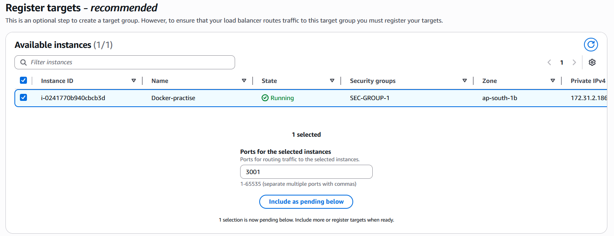
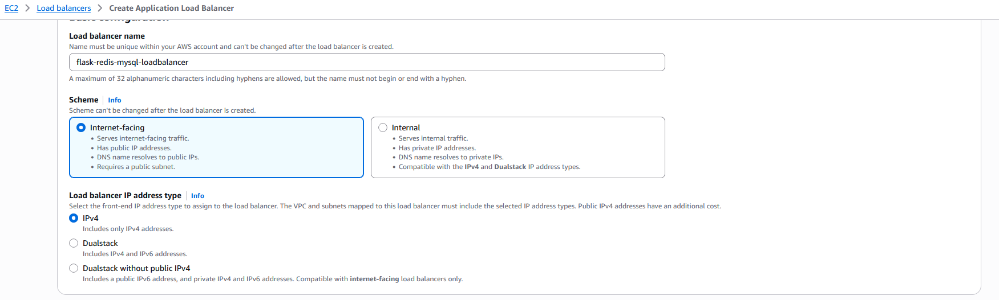
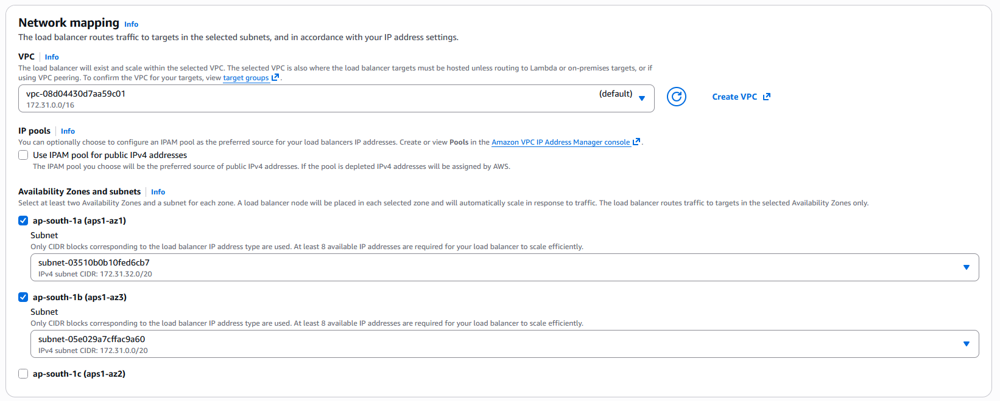
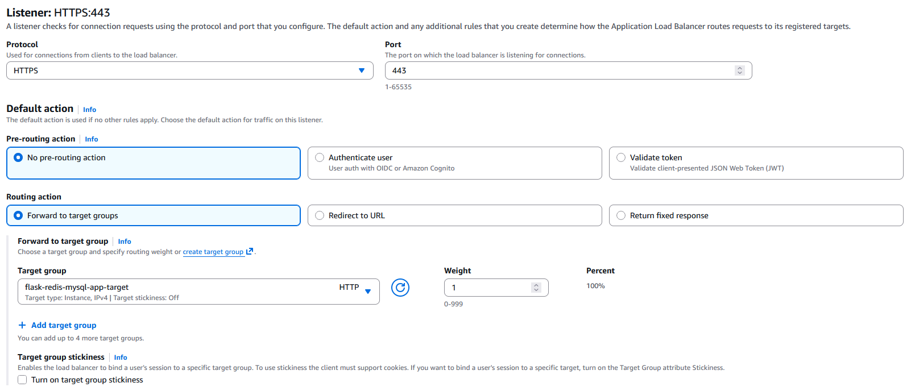
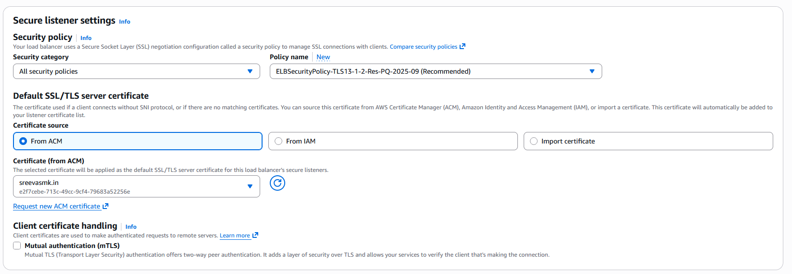
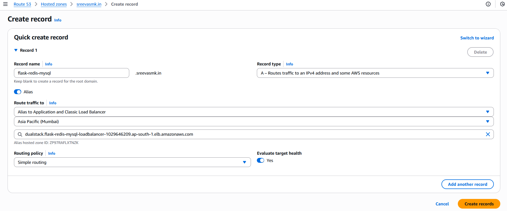

# AWS Application Load Balancer (ALB) & Domain Setup

This guide explains how to set up an AWS Application Load Balancer (ALB) and configure a domain/subdomain via Route 53 for the Flask MySQL Redis application running on EC2 instances.

---

## Folder Structure

```
aws-alb/
├── README.md
└── images/
```

---

## Step 1: Create Target Group

1. Navigate to **EC2 → Target Groups → Create target group**.

2. Select:

   * Target group name
   * Protocol
   * IP address type
   * VPC
     

3. Configure health checks:

   * Path: `/status`
     

4. Add tags as required.
   

5. Select targets (EC2/container instances) and map to Flask container ports **3001** and **3002**:
   
   
   

6. Click **Next** and **Create Target Group**.

---

## Step 2: Create Application Load Balancer (ALB)

1. Navigate to **EC2 → Load Balancers → Create Load Balancer → Application Load Balancer**.

2. Provide:

   * Name
   * VPC
   * Subnets and Availability Zones (select at least 2, e.g., `ap-south-1a` and `ap-south-1b`)
     
     

3. Configure listeners:

   * HTTPS listener
     
   * Select the target group created earlier
   * Choose ACM certificate for SSL
     

4. Configure HTTP listener to redirect traffic to HTTPS
   

5. Review and click **Create Load Balancer**.

---

## Step 3: Add Route 53 Record

1. Open **Route 53 → Hosted zones → Select domain/subdomain**.

2. Create a new record:

   * Type: **A (Alias)**
   * Alias Target: select the ALB created in Step 2
     

3. Save the record. The domain/subdomain now points to the ALB.

---

## Step 4: Verify Application

1. Open the browser and navigate to your domain/subdomain.
2. You should see the Flask MySQL Redis application running.


---

## Notes

* Ensure that EC2 instances running Flask containers are registered with the target group.
* Health checks `/status` ensure ALB routes traffic only to healthy instances.
* Route 53 alias allows users to access the site via a custom domain.
* Manual deployment ensures proper testing before automating with tools like Terraform or Ansible.

